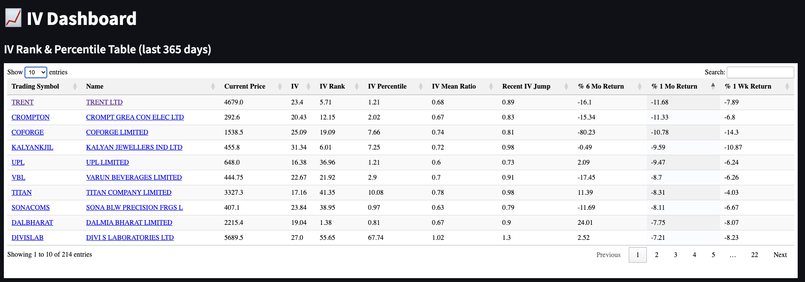

# IV Dashboard - Options Implied Volatility Analytics for Indian Markets

## 📊 What This Project Does

This project provides **real-time Implied Volatility (IV) analytics** for all F&O (Futures & Options) listed stocks and indices in the Indian markets (NSE). It calculates and displays critical volatility metrics that are **NOT available on standard Indian brokers' platforms** like Zerodha, Upstox, Angel One, or Groww.



While these brokers show basic option chains and Greeks, they typically don't provide historical IV analysis, IV Rank, IV Percentile, or comparative volatility metrics - all essential for serious options trading.

## 🎯 Who Is This For?

This tool is designed for **options traders** (not investors) who:
- Trade based on volatility mean reversion strategies
- Sell options when IV is historically high
- Buy options when IV is historically low
- Need quantitative metrics to time their entries and exits
- Want to identify volatility spikes and crushes (especially around earnings/events)

**Prerequisites**: You should be familiar with options trading concepts and implied volatility. This is not a beginner's tool.

## 📈 Key Metrics Calculated

### Primary Volatility Metrics

1. **[IV Rank](https://en.wikipedia.org/wiki/Implied_volatility#IV_Rank)** (0-100)
   - Formula: `(Current IV - 52-week Min IV) / (52-week Max IV - 52-week Min IV) × 100`
   - Shows where current IV stands relative to its yearly range
   - High IV Rank (>70) = Good for option selling
   - Low IV Rank (<30) = Good for option buying

2. **[IV Percentile](https://en.wikipedia.org/wiki/Implied_volatility#IV_Percentile)** (0-100)
   - Percentage of days in the past year with IV lower than current
   - More stable than IV Rank, less affected by outliers
   - Example: 80th percentile means IV was lower 80% of the time

3. **IV Mean Ratio**
   - Current IV divided by 365-day average IV
   - Values > 1.2 indicate elevated volatility
   - Values < 0.8 indicate compressed volatility

4. **Recent IV Jump**
   - Current IV vs 6-day average
   - Identifies sudden volatility spikes (earnings, news events)
   - Useful for event-driven strategies

### Price Performance Metrics
- 6-month, 1-month, and 1-week returns
- Helps correlate price movement with volatility changes

## 🚀 Quick Start

### Installation
```bash
# Clone the repository
git clone https://github.com/anuphw/implied_volatility_analysis.git
cd implied_volatility_analysis

# Install uv package manager (if not already installed)
# Follow the official installation guide: https://docs.astral.sh/uv/getting-started/installation/
# Quick install for macOS/Linux:
curl -LsSf https://astral.sh/uv/install.sh | sh

# Install dependencies
uv sync
```

### Download Market Data
```bash
# Fetches all F&O scripts and historical data from Sensibull API
uv run python download_data.py
```
This downloads:
- 2,166+ F&O underlying instruments
- 365 days of OHLC and IV data for each
- Options/futures contract metadata

### Run the Dashboard
```bash
uv run streamlit run app.py
```
Open http://localhost:8501 in your browser

## 💡 Features

- **Interactive DataTable**: Sort and filter by any metric
- **Direct Links**: Click symbols to open Screener.in or TradingView charts
- **OHLC + IV Charts**: Candlestick charts with IV overlay (365-day view)
- **Real-time Data**: Fetches latest data from Sensibull API
- **SQLite Database**: Fast local storage, no external DB required

## 🔧 Potential Enhancements & Custom Metrics

The codebase is designed to be easily extensible. Here are some metrics you could add:

### Volatility-Based Metrics
- **IV Skew**: Difference between OTM put and call IV
- **Term Structure**: Near-month vs far-month IV ratio
- **HV/IV Ratio**: Historical vs Implied volatility comparison
- **IV Z-Score**: Standard deviations from mean
- **Volatility Smile**: Plot IV across different strikes
- **Put/Call IV Spread**: Identify directional bias

### Event-Driven Metrics
- **Earnings IV Crush**: Pre vs post-earnings IV change patterns
- **Event Volatility Premium**: IV elevation before known events
- **Volatility Regime Detection**: Classify into high/normal/low vol regimes

### Greeks & Risk Metrics
- **Vega Exposure**: Portfolio sensitivity to IV changes
- **IV-adjusted Delta**: Delta accounting for volatility levels
- **Volatility Beta**: Stock's IV correlation with index IV

### Adding Custom Metrics

To add a new metric, modify `get_iv_summary()` in `app.py`:

```python
# Example: Add 30-day IV moving average
def get_iv_summary():
    # ... existing code ...

    # In the groupby loop, add:
    iv_ma_30 = group.iloc[-30:]["iv"].mean() if len(group) >= 30 else None

    # Add to result dictionary:
    "iv_ma_30": round(iv_ma_30, 2) if iv_ma_30 else None
```

## 📊 Data Source

- **Sensibull API**: Public endpoints for options data
- **No authentication required**
- **Coverage**: NSE F&O stocks and indices
- **Update Frequency**: Daily OHLC + IV data

## 🛠️ Tech Stack

- **Backend**: Python 3.12+
- **Database**: SQLite (optimized with indexes)
- **Web Framework**: Streamlit
- **Charts**: Plotly
- **Data Processing**: Pandas
- **Package Manager**: uv (modern Python package manager)
- **Frontend Tables**: DataTables JS

## 📁 Project Structure

```
implied_volatility_analysis/
├── app.py                 # Streamlit dashboard & IV calculations
├── download_data.py       # Data fetching from Sensibull API
├── sensibull.db          # SQLite database (created on first run)
├── download_errors.txt   # Failed ticker logs
└── CLAUDE.md             # AI assistant instructions
```

## ⚠️ Disclaimer

This tool is for **educational and analytical purposes only**. Options trading involves substantial risk of loss. Past volatility patterns don't guarantee future results. Always do your own research and consider consulting a financial advisor.

## 🤝 Contributing

Contributions are welcome! Areas of interest:
- Additional volatility metrics
- Multi-timeframe analysis
- Backtesting framework for volatility strategies
- Options strategy analyzer based on IV levels
- Real-time alerts for IV breakouts

## 📝 License

MIT License - See LICENSE file for details

## 🙏 Acknowledgments

- Sensibull for providing public API access to options data
- The options trading community for volatility trading strategies
- Inspired by the lack of advanced IV tools in standard Indian brokers

---

**Note**: This is NOT a buy/sell recommendation system. It's a data analytics tool for traders who already understand options and implied volatility. Use it as one input among many in your trading decisions.